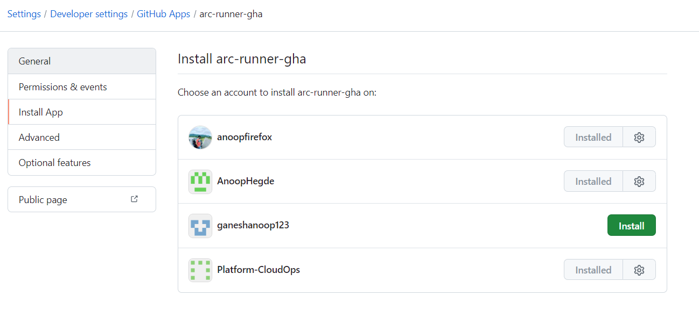

# Github Selfhosted Runner Setup
## Contents

<!-- TOC start -->
  - [Prerequisites](#prerequisites)
  - [Create kind kubernetes cluster for GHA selfhosted runner](#create-kind-cluster-for-GHA-selfhosted-runner)
  - [Authenticating the runner](#authenticating-the-runner)
  - [Setup the Fluxcd GitOps](#setup-fluxcd-gitops)
  - [Build Custom Actions Runner Image](#build-custom-actions-runner-image)
  - [Installing Actions Runner Controller](#installing-Actions-Runner-Controller)
  - [Configure a runner scale set](#configuring-runner-scale-set)
  - [Verify the Runner Installation](#verify-the-Runner-Installation)
  - [Reference Links](#reference-Links)

  <!-- TOC end -->

  ## Prerequisites
  
  1. Create a new free tier Organization and link that organization with trial Enterprise account.
  2. Create a new repository for building and pushing custom actions-runner-image.
  3. Create a new github apps under organizational level and install them to get the appID, appInstallationID, client_secret
     private key.
  4. Create a Azure Container Registry Instance in both npd/prd and activate the access key to get the admin user, Login URI etc.

      

      

  ## Create kind kubernetes cluster for GHA selfhosted runner

  We need to setup two different kind kubernetes cluster ingress Nginx both for npd and prd environments.

  Command to setup:

  ```
  kind create cluster --name gha-selfhosted-cluster --config=gha-selfhosted.yaml
  kubectl cluster-info --context kind-gha-selfhosted-cluster

  kubectl apply -f https://raw.githubusercontent.com/kubernetes/ingress-nginx/main/deploy/static/provider/kind/deploy.yaml

  kubectl get po  -A --context kind-gha-selfhosted-cluster
  kubectl get svc -A --context kind-gha-selfhosted-cluster
  kubectl get ing -A --context kind-gha-selfhosted-cluster

  kind create cluster --name gha-selfhosted-cluster-prd --config=gha-selfhosted-prd.yaml
  kubectl cluster-info --context kind-gha-selfhosted-cluster-prd

  kubectl apply -f https://raw.githubusercontent.com/kubernetes/ingress-nginx/main/deploy/static/provider/kind/deploy.yaml

  kubectl get po  -A --context kind-gha-selfhosted-cluster-prd
  kubectl get svc -A --context kind-gha-selfhosted-cluster-prd
  kubectl get ing -A --context kind-gha-selfhosted-cluster-prd

  ```
     
  ## Authenticating the runner

  We are using GitHub App method for authenticating GitHub to Action Runner Controller.

  1. As an owner of the Organizational Repository we will be having an access to create our own github apps. Get the credentials of a new GitHub App.
  2. GitHub Apps can be installed in user,repository,organizational levels based on the end-user preferences.
  3. Generate a Kubernetes secret "pe-github-secret" within the GHA runner cluster using the App_ID, App_Installation_ID, Private_key.
   
  Screenshots:

  

  

  

  

  

  

   
  ## Setup the Fluxcd GitOps

  1. Install the Latest version of Flux CLI:
      
      Command to Install:

      ```
      https://fluxcd.io
      https://fluxcd.io/flux/cmd/

      curl -s https://fluxcd.io/install.sh | sudo FLUX_VERSION=2.0.0 bash

      flux --version
      flux check --pre
      flux check
      
      Install using Docker 

      A container image with kubectl and flux is available on DockerHub and GitHub:

        docker.io/fluxcd/flux-cli:<version>
        ghcr.io/fluxcd/flux-cli:<version>

      docker run -it --entrypoint=sh -v ~/.kube/config:/kubeconfig ghcr.io/fluxcd/flux-cli:v2.0.0
      / # flux check --kubeconfig=kubeconfig   

      ```

  2.  Boostrap a Flux repo
  
      Before boostrapping the Flux repository its important to structure the overall respository architecture based on components, environments

      The Structure is divided into apps/base, cluster/base, cluster/npd/githubrunner, cluster/prd/githubrunner
      
            ├── README.md
            ├── apps
            │   └── base
            │       ├── actions-runner-controller
            │       │   ├── arc-controller-hr.yaml
            │       │   ├── arc-controller-ns.yaml
            │       │   └── kustomization.yaml
            │       ├── actions-runners
            │       │   ├── arc-runner-hr.yaml
            │       │   ├── arc-runner-ns.yaml
            │       │   └── kustomization.yaml
            │       ├── cert-manager
            │       │   ├── cert-manager-hr.yaml
            │       │   ├── cert-manager-ns.yaml
            │       │   └── kustomization.yaml
            │       ├── kubehunter
            │       │   ├── kubehunter-cronjob.yaml
            │       │   ├── kubehunter-ns.yaml
            │       │   └── kustomization.yaml
            │       └── sources
            │           ├── actions-controller-oci.yaml
            │           ├── jetstack.yaml
            │           └── kustomization.yaml
            ├── charts
            ├── clusters
            │   ├── base
            │   │   └── githubrunner
            │   │       ├── certmanager_ks.yaml
            │   │       ├── githubrunner_ks.yaml
            │   │       ├── kubehunter_ks.yaml
            │   │       ├── kustomization.yaml
            │   │       └── source_ks.yaml
            │   ├── npd
            │   │   ├── githubrunner
            │   │   │   ├── flux-system
            │   │   │   │   ├── gotk-components.yaml
            │   │   │   │   ├── gotk-sync.yaml
            │   │   │   │   └── kustomization.yaml
            │   │   │   └── kustomization.yaml
            │   │   └── staging
            │   │       └── demo.txt
            │   └── prd
            │       ├── githubrunner
            │       │   ├── demo.txt
            │       │   └── flux-system
            │       │       ├── gotk-components.yaml
            │       │       ├── gotk-sync.yaml
            │       │       └── kustomization.yaml
            │       └── prd
            │           └── demo.txt


  3. Run the flux boostrap command:
        
        ```
         export GH_USERNAME=<gha_username>
         export GITHUB_TOKEN=<gha_fine_grained_pattoken>

         flux bootstrap github \
         --token-auth \
         --branch=main \
         --owner=$GH_USERNAME \
         --repository=platformengine-flux-bootstrap \
         --path=clusters/npd/githubrunner \
         --personal=true \
         --private=false \
         --components-extra="image-reflector-controller,image-automation-controller"  

      Similiarly we can perform the flux bootstrap for PRD environment as well.

        ```


  ## Build Custom Actions Runner Image

     We can use ubuntu-latest as a base image and build a custom actions runner image on top of it. Or else if we need a different linux distribution we need to build either redhat or centos base image and proceed further.

     Navigate to https://github.com/Platform-CloudOps/platformengine-actions-runner-image -> we can build our own customized Docker file image for actions runner. This docker image under Platform-CloudOps consists of base packages of ubuntu ACTIONS_BASE="ghcr.io/actions/actions-runner:2.316.1" with kubectl, terraform, azure cli packages installed on it.

     we have a workflow under ./github/workflows/buildImage.yaml -> This is an matrix based gha workflow that runs on 'ubuntu-latest' Github hosted runner which will parallelly build the docker file and push them to npd and prd acr repositories.

     ACR_USERNAME ACR_SECRET, REPOSITORY_URL is stored as github environment secrets:

    

    


 
  ## Installing Actions Runner Controller

  ## Configure a runner scale set

  ## Verify the Runner Installation

  ## Reference Links

