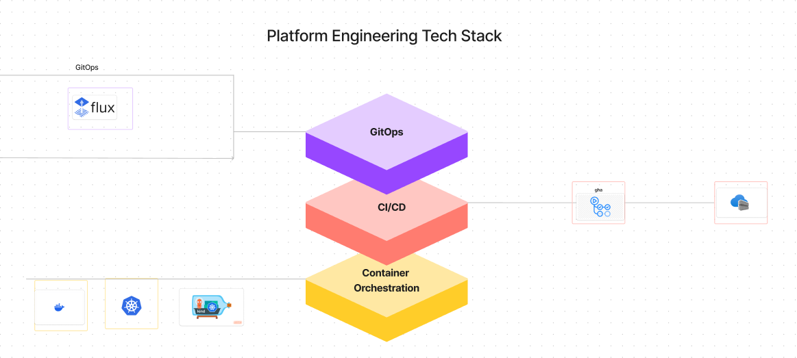

# Github Selfhosted Runner Setup

## Contents

<!-- TOC start -->

- [Prerequisites](#prerequisites)
- [High Level Architecture](#high-level-architecture)
- [Create kind k8's cluster for runner](#create-kind-cluster-for-runner)
- [Authenticating the runner](#authenticating-the-runner)
- [Setup the Fluxcd GitOps](#setup-fluxcd-gitops)
- [Build Custom Actions Runner Image](#build-custom-actions-runner-image)
- [Installing Actions Runner Controller](#installing-Actions-Runner-Controller)
- [Configure a runner scale set](#configuring-runner-scale-set)
- [Verify the Runner Installation](#verify-the-Runner-Installation)
- [Reference Links](#reference-Links)

  <!-- TOC end -->

## Prerequisites

1. Create a new free tier Organization and link that organization with trial Enterprise account.
2. Create a new repository for building and pushing custom actions-runner-image.
3. Create a new github apps under organizational level and install them to get the appID, appInstallationID, client_secret
   private key.
4. Create a Azure Container Registry Instance in both npd/prd and activate the access key to get the admin user, Login URI etc.


## High Level Architecture




Figma Link: 

https://www.figma.com/board/775gueljgCIlEOfrO6fHtP/GitHub-Self-Hosted-Runner-High-level-Design?node-id=0%3A1&t=X8beNCQJGSEL0Ovl-1

## Create kind k8's cluster for runner

We need to setup two different kind kubernetes cluster ingress Nginx both for npd and prd environments.

Command to setup:

```
kind create cluster --name gha-selfhosted-cluster --config=gha-selfhosted.yaml
kubectl cluster-info --context kind-gha-selfhosted-cluster

kubectl apply -f https://raw.githubusercontent.com/kubernetes/ingress-nginx/main/deploy/static/provider/kind/deploy.yaml

kubectl get po  -A --context kind-gha-selfhosted-cluster
kubectl get svc -A --context kind-gha-selfhosted-cluster
kubectl get ing -A --context kind-gha-selfhosted-cluster

kind create cluster --name gha-selfhosted-cluster-prd --config=gha-selfhosted-prd.yaml
kubectl cluster-info --context kind-gha-selfhosted-cluster-prd

kubectl apply -f https://raw.githubusercontent.com/kubernetes/ingress-nginx/main/deploy/static/provider/kind/deploy.yaml

kubectl get po  -A --context kind-gha-selfhosted-cluster-prd
kubectl get svc -A --context kind-gha-selfhosted-cluster-prd
kubectl get ing -A --context kind-gha-selfhosted-cluster-prd

```

## Authenticating the runner

We are using GitHub App method for authenticating GitHub to Action Runner Controller.

1. As an owner of the Organizational Repository we will be having an access to create our own github apps. Get the credentials of a new GitHub App.
2. GitHub Apps can be installed in user,repository,organizational levels based on the end-user preferences.
3. Generate a Kubernetes secret "pe-github-secret" within the GHA runner cluster using the App_ID, App_Installation_ID, Private_key.

Screenshots:


## Setup the Fluxcd GitOps

1.  Install the Latest version of Flux CLI:

    Command to Install:

    ```
    https://fluxcd.io
    https://fluxcd.io/flux/cmd/

    curl -s https://fluxcd.io/install.sh | sudo FLUX_VERSION=2.0.0 bash

    flux --version
    flux check --pre
    flux check

    Install using Docker

    A container image with kubectl and flux is available on DockerHub and GitHub:

    docker.io/fluxcd/flux-cli:<version>
    ghcr.io/fluxcd/flux-cli:<version>

    docker run -it --entrypoint=sh -v ~/.kube/config:/kubeconfig ghcr.io/fluxcd/flux-cli:v2.0.0
    / # flux check --kubeconfig=kubeconfig

    ```

2.  Boostrap a Flux repo

    Before boostrapping the Flux repository its important to structure the overall respository architecture based on components, environments

    The Structure is divided into apps/base, cluster/base, cluster/npd/githubrunner, cluster/prd/githubrunner

          ├── README.md
          ├── apps
          │   └── base
          │       ├── actions-runner-controller
          │       │   ├── arc-controller-hr.yaml
          │       │   ├── arc-controller-ns.yaml
          │       │   └── kustomization.yaml
          │       ├── actions-runners
          │       │   ├── arc-runner-hr.yaml
          │       │   ├── arc-runner-ns.yaml
          │       │   └── kustomization.yaml
          │       ├── cert-manager
          │       │   ├── cert-manager-hr.yaml
          │       │   ├── cert-manager-ns.yaml
          │       │   └── kustomization.yaml
          │       ├── kubehunter
          │       │   ├── kubehunter-cronjob.yaml
          │       │   ├── kubehunter-ns.yaml
          │       │   └── kustomization.yaml
          │       └── sources
          │           ├── actions-controller-oci.yaml
          │           ├── jetstack.yaml
          │           └── kustomization.yaml
          ├── charts
          ├── clusters
          │   ├── base
          │   │   └── githubrunner
          │   │       ├── certmanager_ks.yaml
          │   │       ├── githubrunner_ks.yaml
          │   │       ├── kubehunter_ks.yaml
          │   │       ├── kustomization.yaml
          │   │       └── source_ks.yaml
          │   ├── npd
          │   │   ├── githubrunner
          │   │   │   ├── flux-system
          │   │   │   │   ├── gotk-components.yaml
          │   │   │   │   ├── gotk-sync.yaml
          │   │   │   │   └── kustomization.yaml
          │   │   │   └── kustomization.yaml
          │   │   └── staging
          │   │       └── demo.txt
          │   └── prd
          │       ├── githubrunner
          │       │   ├── demo.txt
          │       │   └── flux-system
          │       │       ├── gotk-components.yaml
          │       │       ├── gotk-sync.yaml
          │       │       └── kustomization.yaml
          │       └── prd
          │           └── demo.txt

3.  Run the flux boostrap command:

    ```
     export GH_USERNAME=<gha_username>
     export GITHUB_TOKEN=<gha_fine_grained_pattoken>

     flux bootstrap github \
     --token-auth \
     --branch=main \
     --owner=$GH_USERNAME \
     --repository=platformengine-flux-bootstrap \
     --path=clusters/npd/githubrunner \
     --personal=true \
     --private=false \
     --components-extra="image-reflector-controller,image-automation-controller"

    Similiarly we can perform the flux bootstrap for PRD environment as well.

    ```

## Build Custom Actions Runner Image

We can use ubuntu-latest as a base image and build a custom actions runner image on top of it. Or else if we need a different linux distribution we need to build either redhat or centos base image and proceed further.

Navigate to https://github.com/Platform-CloudOps/platformengine-actions-runner-image -> we can build our own customizeDocker file image for actions runner. This docker image under Platform-CloudOps consists of base packages of ubuntACTIONS_BASE="ghcr.io/actions/actions-runner:2.316.1" with kubectl, terraform, azure cli packages installed on it.

we have a workflow under ./github/workflows/buildImage.yaml -> This is an matrix based gha workflow that runs o'ubuntu-latest' Github hosted runner which will parallelly build the docker file and push them to npd and prd acrepositories. ACR_USERNAME ACR_SECRET, REPOSITORY_URL is stored as github environment secrets.


## Installing Actions Runner Controller

1. Navigate to apps/base -> create actions-runners , actions-runner-controller config folder
2. Create helm release , namespace and kustomization config file and deploy them.
3. Create cert-manager helm release , namespace and kustomization config file and deploy them.

## Configure a runner scale set

1. Navigate to apps/base -> create actions-runners , actions-runner-controller config folder
2. Create helm release , namespace and kustomization config file and deploy them.
3. Navigate to clusters/base/githubrunner -> and write certmanager,githubrunner,kubehunter,source_ks and kustomization  
   config files.
4. Under clusters/npd/githubrunner/ -> write a patch json kustomization to override the env_class.
5. Deploy a shared-config map under flux-system namespace that consists all the common configs.

```

  kubectl get cm shared-config -n flux-system -o yaml

  kubectl create secret docker-registry docker-secret \
  --namespace flux-system \
  --docker-server=peacrnpd.azurecr.io \
  --docker-username=peacrnpd \
  --docker-password=<secret>


  kubectl create secret docker-registry docker-secret \
  --namespace arc-runners \
  --docker-server=peacrnpd.azurecr.io \
  --docker-username=peacrnpd \
  --docker-password=<secret>


  kubectl create secret generic pe-github-secret \
  -n arc-runners \
  --from-literal=github_app_id=<app_id> \
  --from-literal=github_app_installation_id=<app_installation_id> \
  --from-file=github_app_private_key=gh-arc-runner-privatekey.pem

```

## Verify the Runner Installation

```
 helm list -A
NAME                            NAMESPACE       REVISION        UPDATED                                 STATUS          CHART
        APP VERSION
pe-arc-controller               arc-systems     1               2024-05-20 14:42:08.577382378 +0000 UTC deployed        gha-runner-scale-set-controller-0.4.0       0.4.0
pe-arc-runner-shared-npd        arc-runners     2               2024-05-21 03:32:40.320219392 +0000 UTC deployed        gha-runner-scale-set-0.4.0
        0.4.0
pe-cert-manager                 cert-manager    1               2024-05-20 14:42:06.34203428 +0000 UTC  deployed        cert-manager-v1.8.0
        v1.8.0

kubectl get pods -n arc-systems
NAME                                                              READY   STATUS    RESTARTS       AGE
pe-arc-controller-gha-runner-scale-set-controller-8f4d9cd7fk6rp   1/1     Running   7 (139m ago)   2d19h
pe-arc-runner-shared-npd-754b578d-listener                        1/1     Running   0              139m


kubectl get pods -n arc-runners
NAME                                          READY   STATUS    RESTARTS   AGE
pe-arc-runner-shared-npd-44t2r-runner-v74mv   2/2     Running   0          14s

kubectl get gitrepo -A
NAMESPACE     NAME          URL                                                                      AGE     READY   STATUS
flux-system   flux-system   https://github.com/Platform-CloudOps/platformengine-flux-bootstrap.git   2d19h   True    stored artifact for revision 'main@sha1:036ae5fd50dd44915eb8dd74a4a97ffa4b21b9da'

kubectl get helmrepo -A
NAMESPACE     NAME       URL                                                      AGE     READY   STATUS
flux-system   arc        oci://ghcr.io/actions/actions-runner-controller-charts   2d19h
flux-system   jetstack   https://charts.jetstack.io                               2d19h   True    stored artifact: revision 'sha256:f3f87c94e282617f9e4b980a38def558e05ef8624fb41ec39ffae32fa6a4bd3a'

flux get hr -A
NAMESPACE       NAME                    REVISION        SUSPENDED       READY   MESSAGE

arc-runners     arc-runner-shared-npd   0.4.0           False           True    Helm upgrade succeeded for release arc-runners/pe-arc-runner-shared-npd.v2 with chart gha-runner-scale-set@0.4.0
arc-systems     arc                     0.4.0           False           True    Helm install succeeded for release arc-systems/pe-arc-controller.v1 with chart gha-runner-scale-set-controller@0.4.0
flux-system     cert-manager            v1.8.0          False           True    Helm install succeeded for release cert-manager/pe-cert-manager.v1 with chart cert-manager@v1.8.0


flux get ks -A
NAMESPACE       NAME            REVISION                SUSPENDED       READY   MESSAGE

flux-system     cert-manager    main@sha1:036ae5fd      False           True    Applied revision: main@sha1:036ae5fd
flux-system     githubrunner    main@sha1:036ae5fd      False           True    Applied revision: main@sha1:036ae5fd
flux-system     kube-hunter     main@sha1:036ae5fd      False           True    Applied revision: main@sha1:036ae5fd
flux-system     runner-set      main@sha1:036ae5fd      False           True    Applied revision: main@sha1:036ae5fd
flux-system     sources         main@sha1:036ae5fd      False           True    Applied revision: main@sha1:036ae5fd
flux-system     flux-system     main@sha1:036ae5fd      False           True    Applied revision: main@sha1:036ae5fd

flux get all -A
NAMESPACE       NAME                            REVISION                SUSPENDED       READY   MESSAGE
flux-system     gitrepository/flux-system       main@sha1:036ae5fd      False           True    stored artifact for revision 'main@sha1:036ae5fd'

NAMESPACE       NAME                    REVISION        SUSPENDED       READY   MESSAGE
flux-system     helmrepository/arc                      False           True    Helm repository is Ready
flux-system     helmrepository/jetstack sha256:f3f87c94 False           True    stored artifact: revision 'sha256:f3f87c94'

NAMESPACE       NAME                                            REVISION        SUSPENDED       READY   MESSAGE

flux-system     helmchart/arc-runners-arc-runner-shared-npd     0.4.0           False           True    pulled 'gha-runner-scale-set' chart with version '0.4.0'
flux-system     helmchart/arc-systems-arc                       0.4.0           False           True    pulled 'gha-runner-scale-set-controller' chart with version '0.4.0'
flux-system     helmchart/flux-system-cert-manager              v1.8.0          False           True    pulled 'cert-manager' chart with version 'v1.8.0'


NAMESPACE       NAME                                    REVISION        SUSPENDED       READY   MESSAGE

arc-runners     helmrelease/arc-runner-shared-npd       0.4.0           False           True    Helm upgrade succeeded for release arc-runners/pe-arc-runner-shared-npd.v2 with chart gha-runner-scale-set@0.4.0
arc-systems     helmrelease/arc                         0.4.0           False           True    Helm install succeeded for release arc-systems/pe-arc-controller.v1 with chart gha-runner-scale-set-controller@0.4.0
flux-system     helmrelease/cert-manager                v1.8.0          False           True    Helm install succeeded for release cert-manager/pe-cert-manager.v1 with chart cert-manager@v1.8.0

NAMESPACE       NAME                            REVISION                SUSPENDED       READY   MESSAGE

flux-system     kustomization/flux-system       main@sha1:036ae5fd      False           True    Applied revision: main@sha1:036ae5fd
flux-system     kustomization/cert-manager      main@sha1:036ae5fd      False           True    Applied revision: main@sha1:036ae5fd
flux-system     kustomization/githubrunner      main@sha1:036ae5fd      False           True    Applied revision: main@sha1:036ae5fd
flux-system     kustomization/kube-hunter       main@sha1:036ae5fd      False           True    Applied revision: main@sha1:036ae5fd
flux-system     kustomization/runner-set        main@sha1:036ae5fd      False           True    Applied revision: main@sha1:036ae5fd
flux-system     kustomization/sources           main@sha1:036ae5fd      False           True    Applied revision: main@sha1:036ae5fd


Test Workflow:

https://github.com/Platform-CloudOps/platformengine-manifest-examples/actions/runs/9205944377/job/25322733741

```


## Reference Links

1. https://docs.github.com/en/actions/hosting-your-own-runners/managing-self-hosted-runners/about-self-hosted-runners
2. https://docs.github.com/en/actions/hosting-your-own-runners/managing-self-hosted-runners-with-actions-runner-controller/quickstart-for-actions-runner-controller
3. https://fluxcd.io/
4. https://learn.microsoft.com/en-us/azure/container-registry/container-registry-auth-kubernetes
5. https://www.bing.com/search?pglt=43&q=add+azure+terraform+provider+into+github+self+hosted+runner+image&cvid=44d66ad2c57d48a9825506b500195ebf&gs_lcrp=EgZjaHJvbWUyBggAEEUYOTIICAEQ6QcY_FXSAQkxMjEwNGowajGoAgCwAgA&FORM=ANNAB1&PC=U531&ntref=1
6. https://github.com/liatrio/terraform-azure-github-runner
7. https://github.com/waylew-lexis/terraform-azurerm-github-runner
8. https://www.youtube.com/watch?v=lD0t-UgKfEo -> GitHub Actions Self Hosted Runner (Autoscaling with Kubernetes)
9. Components for ARC runner setup -> https://www.youtube.com/watch?v=lD0t-UgKfEo
10. https://github.com/antonputra/tutorials/tree/main/lessons/089
11. https://www.youtube.com/watch?v=_F5ocPrv6io -> GitHub Actions: Dive into actions-runner-controller (ARC) || Advanced installation & configuration.
